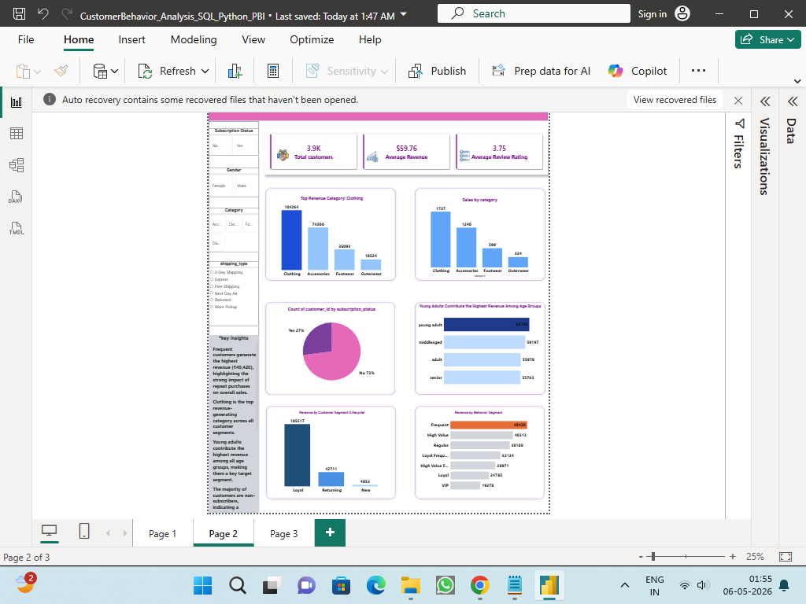
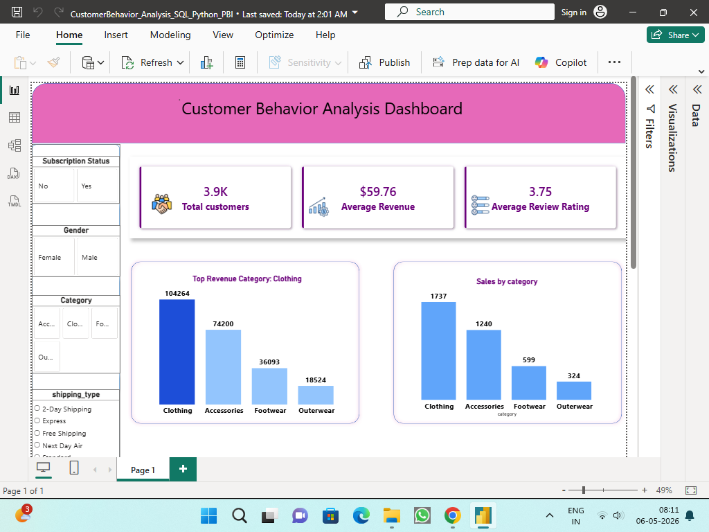
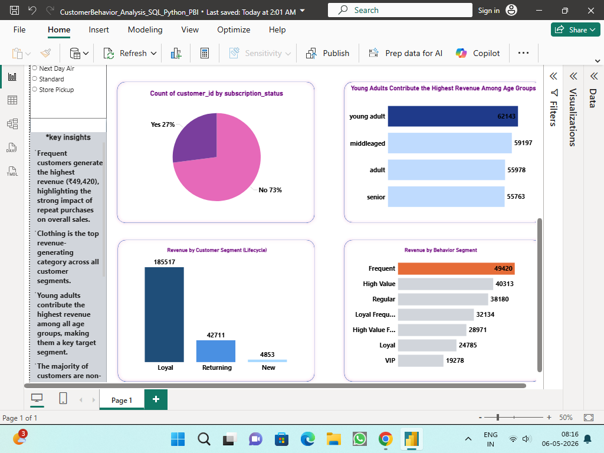
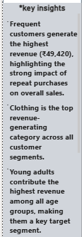

# 📊 Customer Shopping Behavior Analysis

### End-to-End Retail Analytics Project | Python · SQL · Power BI

An end-to-end **retail analytics project** analyzing **3,900 customer transactions across 18 fields** to understand customer purchasing behavior, identify high-value customer segments, evaluate product performance, and generate actionable business recommendations.

**Analytics Workflow**

`Raw Data → Python → SQL → Customer Segmentation → Power BI → Business Recommendations`

---

## 🎯 Business Problem

A retail business wants to better understand **customer behavior, purchasing patterns, revenue drivers, and retention opportunities**.

This project answers key business questions:

- Which customer segments generate the most revenue?
- Which product categories and products perform best?
- Do subscribers behave differently from non-subscribers?
- How does purchase frequency relate to revenue?
- Which customer groups should marketing prioritize?
- How can customer retention and subscription adoption be improved?

The objective is to transform transactional data into **clear business insights and actionable recommendations**.

---

## 📌 Project Objectives

- Analyze customer purchasing patterns
- Identify high-value and loyal customer segments
- Evaluate revenue contribution by customer characteristics
- Compare subscriber and non-subscriber behavior
- Identify top-performing products and categories
- Analyze purchase frequency and customer behavior
- Build an interactive Power BI dashboard
- Translate analytical findings into actionable business recommendations

---

## 📂 Dataset Overview

The dataset contains:

- **3,900 customer transaction records**
- **18 fields**
- Customer, product, transaction, behavioral, and satisfaction attributes

### 👤 Customer Information

- Age
- Gender
- Location
- Subscription Status

### 🛍️ Purchase Information

- Item Purchased
- Category
- Purchase Amount
- Season
- Size
- Color

### 📈 Behavioral & Transaction Metrics

- Discount Applied
- Promo Code Used
- Previous Purchases
- Frequency of Purchases
- Shipping Type
- Review Rating

---

## 🛠️ Tools & Technologies

| Tool / Technology | Purpose |
|---|---|
| 🐍 **Python / Pandas** | Data cleaning, preprocessing and exploratory data analysis |
| 🗄️ **SQL** | Business analysis, aggregations and customer segmentation |
| 🔢 **CTEs & Window Functions** | Advanced SQL analysis and product ranking |
| 📊 **Power BI** | Interactive dashboards, KPIs and data visualization |
| 🐙 **GitHub** | Project documentation and version control |

---

# 🔄 Analytics Workflow

## 1️⃣ Data Preparation & EDA — Python

The raw dataset was inspected, cleaned and prepared for analysis using Python and Pandas.

### Key Activities

- Data quality checks
- Missing-value identification
- Data consistency checks
- Exploratory data analysis
- Feature preparation
- Statistical analysis
- Review-rating imputation

The dataset contained **37 missing values in `Review Rating`**.

These missing values were handled using **category-wise median imputation** to preserve the rating distribution within each product category.

---

## 2️⃣ Business Analysis — SQL

SQL was used to answer business-focused questions and generate analytical insights.

### Analysis Performed

- Revenue analysis
- Customer segmentation
- Purchase-frequency analysis
- Subscriber vs. non-subscriber comparison
- Product ranking
- Category-level performance
- Customer behavior analysis
- Aggregations and conditional logic
- CTE-based analysis
- Window-function analysis

---

## 3️⃣ 👥 Customer Segmentation

Customers were segmented based on their previous purchasing behavior.

| Customer Segment | Definition |
|---|---|
| 🆕 **New** | 1 previous purchase |
| 🔄 **Returning** | 2–10 previous purchases |
| 💎 **Loyal** | More than 10 previous purchases |

This segmentation helps identify different levels of customer engagement and supports **targeted marketing and retention strategies**.

---

# 📊 Power BI Dashboard

The Power BI dashboard provides an interactive view of:

- Revenue performance
- Product performance
- Category performance
- Customer segmentation
- Subscriber vs. non-subscriber behavior
- Purchase frequency
- Customer behavior
- Key business insights

## Dashboard Preview

### 🔹 Sales Overview



### 🔹 Product Performance



### 🔹 Customer Segmentation



### 🔹 Key Insights



---

# 📈 Key Business Insights

## 1. 👕 Clothing Is a Major Revenue Driver

**Finding:** Clothing is the top-performing category in terms of sales and revenue.

**Business Impact:** Clothing represents an important revenue-generating category.

**Recommendation:**

- Maintain strong inventory availability
- Promote high-performing clothing products
- Use cross-selling opportunities
- Monitor category demand closely

---

## 2. 💎 Loyal Customers Are the Highest-Value Segment

**Finding:** Loyal customers contribute the highest share of total revenue.

**Business Impact:** Customers with stronger purchase histories represent an important source of recurring revenue.

**Recommendation:**

- Prioritize loyalty campaigns
- Provide personalized offers
- Introduce exclusive benefits
- Develop retention-focused campaigns
- Monitor high-value customers for churn risk

---

## 3. 🔄 Purchase Frequency Is Linked to Customer Value

**Finding:** Frequent buyers generate higher revenue than occasional buyers.

**Business Impact:** Purchase frequency is an important indicator of customer value.

**Recommendation:**

- Use personalized recommendations
- Send repeat-purchase reminders
- Offer limited-time promotions
- Introduce loyalty rewards
- Promote relevant products based on purchase history

### 🎯 Business Goal

Move customers through the journey:

**Occasional → Returning → Loyal**

---

## 4. ⭐ Subscription Is a Retention Opportunity

**Finding:** Subscribers demonstrate stronger purchasing engagement.

**Business Impact:** Subscription status appears to be associated with stronger customer engagement.

**Recommendation:**

Prioritize subscription campaigns toward:

- Frequent buyers
- Returning customers
- Customers with strong purchase histories
- Highly engaged customers

### 🎯 Business Goal

Convert engaged customers into subscribers and strengthen long-term retention.

---

## 5. 👥 Younger Customers Show Higher Transaction Spending

**Finding:** Younger customer groups show higher spending per transaction.

**Business Impact:** Younger customers may represent an attractive audience for targeted marketing campaigns.

**Recommendation:**

- Test age-specific promotions
- Personalize product recommendations
- Develop targeted campaigns
- Monitor long-term customer value

---

## 6. 😊 Customer Satisfaction Is Generally Positive

**Finding:** Average customer rating is approximately **3.75 / 5**.

**Business Impact:** Overall customer satisfaction is reasonably positive, while lower-rated products may present improvement opportunities.

**Recommendation:**

Analyze lower-rated products and categories to identify potential issues related to:

- Product quality
- Product expectations
- Shipping experience
- Sizing or fit
- Overall customer experience

---

# 💡 Business Recommendations

| Customer Segment | Recommended Strategy | Business Goal |
|---|---|---|
| 🆕 **New** | Welcome campaigns and first-repeat incentives | Encourage second purchase |
| 🔄 **Returning** | Personalized recommendations and targeted offers | Increase purchase frequency |
| 💎 **Loyal** | Loyalty rewards, exclusive offers and retention campaigns | Protect recurring revenue |
| ⭐ **Frequent Buyers** | Subscription-focused offers | Increase subscription adoption |

### Overall Customer Growth Strategy

The business should aim to move customers toward higher-value behavior:

**New → Returning → Loyal → Subscriber**

---

# 🧮 SQL Analysis Examples

## Customer Segmentation

```sql
WITH customer_type AS (
    SELECT
        customer_id,
        CASE
            WHEN previous_purchases = 1 THEN 'New'
            WHEN previous_purchases BETWEEN 2 AND 10 THEN 'Returning'
            ELSE 'Loyal'
        END AS customer_segment
    FROM customer
)

SELECT
    customer_segment,
    COUNT(*) AS number_of_customers
FROM customer_type
GROUP BY customer_segment;

---
🏆 Top Products by Category
WITH item_counts AS (
    SELECT
        category,
        item_purchased,
        COUNT(*) AS total_orders,
        ROW_NUMBER() OVER (
            PARTITION BY category
            ORDER BY COUNT(*) DESC
        ) AS rank
    FROM customer
    GROUP BY category, item_purchased
)

SELECT
    category,
    item_purchased,
    total_orders
FROM item_counts
WHERE rank <= 3;

---
⭐ Subscriber vs. Non-Subscriber Analysis
SELECT
    subscription_status,
    COUNT(customer_id) AS total_customers,
    ROUND(AVG(purchase_amount), 2) AS avg_spend,
    ROUND(SUM(purchase_amount), 2) AS total_revenue
FROM customer
GROUP BY subscription_status
ORDER BY total_revenue DESC;

SQL Techniques Demonstrated
CTEs · CASE Statements · Window Functions · ROW_NUMBER() · GROUP BY · Aggregations · Conditional Logic

# 📁 Project Files

| File | Description |
|---|---|
| [customer_shopping_behavior.csv](customer_shopping_behavior.csv) | Raw customer shopping dataset |
| [customer_shopping_behavior_analysis.ipynb](customer_shopping_behavior_analysis.ipynb) | Python data cleaning, preprocessing and EDA |
| [sql_queries.sql](sql_queries.sql) | SQL business analysis and customer segmentation |
| [CustomerBehavior_Analysis_SQL_Python_PBI.pbix](CustomerBehavior_Analysis_SQL_Python_PBI.pbix) | Interactive Power BI dashboard |
| [dashboard_overview.png](dashboard_overview.png) | Sales and revenue dashboard |
| [product_performance.png](product_performance.png) | Product and category analysis |
| [customer_segmentation.png](customer_segmentation.png) | Customer segmentation dashboard |
| [key_insights.png](key_insights.png) | Key business insights |

🚀 How to Explore the Project
Step 1 — Dataset
Start with:

customer_shopping_behavior.csv

Review the raw customer transaction data.

Step 2 — Python Analysis
Open:

customer_shopping_behavior_analysis.ipynb

Review:

Data cleaning
Missing-value treatment
Data preprocessing
Exploratory data analysis
Step 3 — SQL Analysis
Open:

sql_queries.sql

Review:

Customer segmentation
Revenue analysis
Product ranking
CTEs
Window functions
Aggregations
Step 4 — Power BI Dashboard
Open:

CustomerBehavior_Analysis_SQL_Python_PBI.pbix

Explore the interactive dashboards and business insights.

🎯 Business Value
This project demonstrates the complete analytics process:

Data → Analysis → Insight → Business Decision

The analysis provides recommendations around:

Customer retention
Customer segmentation
Subscription conversion
Purchase-frequency growth
Product optimization
Category performance
Targeted marketing
Customer experience
The focus is not only on what happened, but also on what the business should do next.

🧠 Skills Demonstrated
Technical Skills
Python · Pandas · SQL · Power BI · Data Cleaning · EDA · Data Visualization · CTEs · Window Functions

Analytical Skills
Customer Segmentation · Revenue Analysis · Product Analysis · Customer Behavior Analysis · KPI Development · Data Storytelling

Business Skills
Customer Retention · Subscription Strategy · Marketing Prioritization · Revenue Optimization · Customer Experience

# 👤 Author

## Chandrashekar Sharma M

**Data Analyst | Python | SQL | Power BI**

### Connect With Me


**Chandrashekar Sharma M**

- GitHub: https://github.com/csmahi  
- LinkedIn: https://www.linkedin.com/in/chandrashekar-m-807267296/  

⭐ Project Summary
Customer Shopping Behavior Analysis is an end-to-end retail analytics project demonstrating how Python, SQL and Power BI can transform transactional data into actionable business insights.

The project combines data analytics, visualization and business thinking to identify:

High-value customers
Revenue drivers
Customer segments
Purchase behavior
Subscription opportunities
Retention strategies
Product and category performance
The objective is simple: turn customer data into insights that help the business improve retention, engagement and revenue.
